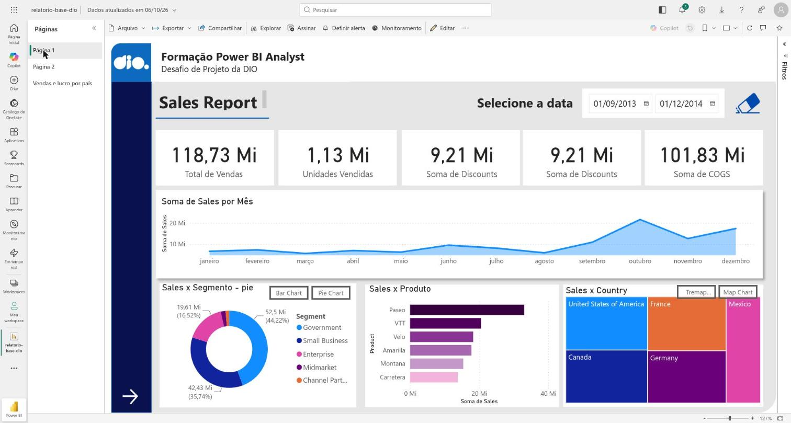
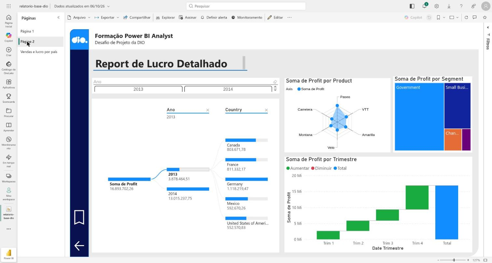
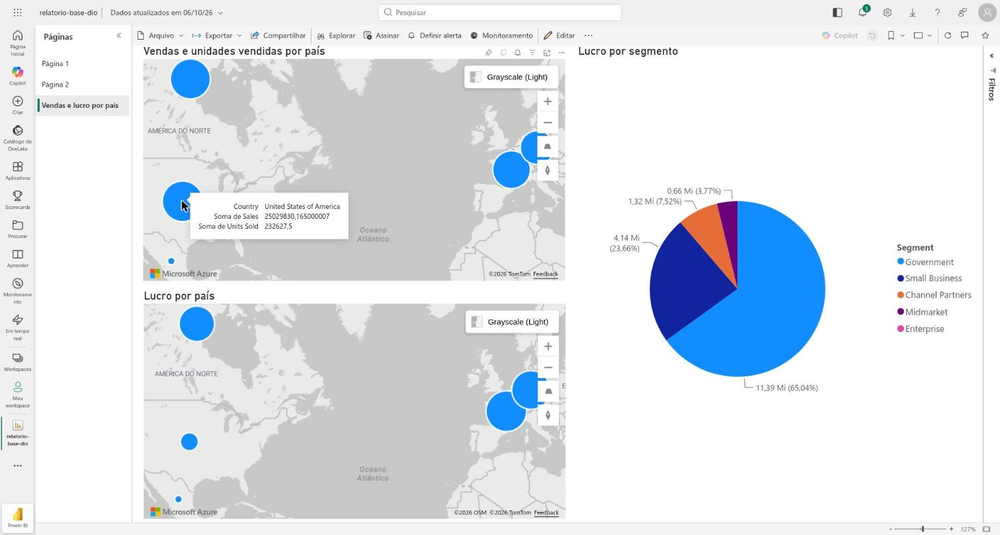

# Relatório de vendas com Power BI (Financial Sample)

Primeiro desafio de projeto do bootcamp de Power BI da DIO. O relatório usa a base **Financial Sample** da Microsoft, disponibilizada no repositório da expert [julianazanelatto/power_bi_analyst](https://github.com/julianazanelatto/power_bi_analyst).

## Objetivo

- Replicar as duas páginas construídas durante o curso.
- Criar uma terceira página com visuais de mapa e de pizza.
- Publicar o relatório e compartilhá-lo como suplemento no PowerPoint.

## Páginas do relatório

| Página | Conteúdo |
|---|---|
| 1. Visão geral de vendas | Cartões (unidades vendidas, descontos, COGS, vendas), vendas por segmento, por produto, por mês e por país |
| 2. Análise de lucro | Árvore de decomposição do lucro (ano → país), cascata por trimestre, radar por produto, treemap por segmento |
| 3. Vendas e lucro por país | Mapa de vendas e unidades vendidas por país, mapa de lucro por país, pizza de lucro por segmento |

### Página 3 em detalhe

| Visual | Campos | Dica de ferramenta |
|---|---|---|
| Mapa: *Vendas e unidades vendidas por país* | Local: `Country` · Tamanho da bolha: `Sales` | `Units Sold` |
| Mapa: *Lucro por país* | Local: `Country` · Tamanho da bolha: `Profit` | — |
| Pizza: *Lucro por segmento* | Legenda: `Segment` · Valores: `Profit` | — |

## Estrutura

```
dataset/     base Financial Sample (.xlsx)
relatorio/   arquivo .pbix do relatório
imagens/     prints das páginas
```

## Prints

### Página 1 – Visão geral de vendas



### Página 2 – Análise de lucro



### Página 3 – Vendas e lucro por país

A dica de ferramenta do primeiro mapa mostra as unidades vendidas de cada país.



## Ajustes em relação ao arquivo do curso

O relatório foi editado no Power BI Service, então alguns visuais precisaram de ajuste:

- Os mapas usam **Azure Maps**, porque o visual de mapa do Bing está sendo descontinuado.
- O **Chiclet Slicer** e o **Radar Chart** da página 2 foram adicionados de novo pelo AppSource, com os mesmos campos (Ano; Product × Profit), porque o serviço não carregou os visuais personalizados que vieram no `.pbix`.

## Status

- [x] Páginas 1 e 2 replicadas
- [x] Página 3 criada
- [x] Relatório publicado no Power BI Service
- [ ] Compartilhado como suplemento no PowerPoint
- [x] Prints das páginas adicionados

## Ferramentas

Power BI Service (app.powerbi.com) e PowerPoint.
